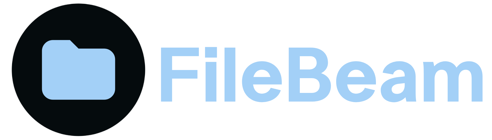

<h2>ItsWhisp 〜 ☆</h2>
<strong>16 y.o. from costa rica</strong> - <strong>intento de desarollador front end</strong> - <strong>desperdicio de datos en el internet</strong>
 
 

<h2>Actualmente uso</h2>

### Herramientas de desarollo

### Tecnologias, lenguajes y frameworks

 

## Me gustaria aprender...

<h2>Proyectos actuales</h2>

<code>¡Gracias por pasarte por mi perfil!</code>

